# Analyzer Rule Generator

AI-powered tool for generating [Konveyor analyzer](https://github.com/konveyor/analyzer-lsp) rules from migration guides and documentation.

## Overview

The Analyzer Rule Generator uses Large Language Models (LLMs) to automatically extract migration patterns from documentation and generate static analysis rules for the Konveyor analyzer. This helps migration teams quickly create comprehensive rulesets without manual authoring.

## Features

- **Multiple Input Formats**: URLs, Markdown files, plain text
- **Multi-Language Support**: Java, TypeScript/React, Go, Python, CSS, and more
- **LLM-Powered Extraction**: Automatically identifies migration patterns, complexity, and conditions
- **Konveyor Analyzer Format**: Generates rules compatible with analyzer-lsp
- **Flexible LLM Support**: OpenAI, Anthropic Claude, Google Gemini
- **Smart Provider Detection**: Automatically uses Java or Builtin provider based on detected language
- **Pattern Detection**: Extracts fully qualified class names, regex patterns, and file globs

## Quick Start

```bash
# Install dependencies
pip install -r requirements.txt

# Set up your LLM API key
export OPENAI_API_KEY="your-key-here"

# Generate rules from a migration guide
python scripts/generate_rules.py \
  --guide examples/guides/spring-boot-to-quarkus.md \
  --source spring-boot \
  --target quarkus \
  --output examples/output/spring-boot-to-quarkus.yaml
```

## How It Works

```mermaid
flowchart TD
    A[📄 Migration Guide] --> B[🤖 LLM Extraction]
    B --> C{Language Detection}

    C -->|Java| D[Java Provider<br/>✓ Fully Qualified Names<br/>✓ Location Types]
    C -->|TypeScript/React/Go/Python| E[Builtin Provider<br/>✓ Regex Patterns<br/>✓ File Globs]

    D --> F[📋 Konveyor Rules]
    E --> F
    F --> G[🔬 Analyzer]

    style A fill:#e3f2fd,stroke:#1976d2,stroke-width:2px
    style B fill:#fff3e0,stroke:#f57c00,stroke-width:2px
    style C fill:#f3e5f5,stroke:#7b1fa2,stroke-width:2px
    style D fill:#e8f5e9,stroke:#388e3c,stroke-width:2px
    style E fill:#e8f5e9,stroke:#388e3c,stroke-width:2px
    style F fill:#fff9c4,stroke:#f9a825,stroke-width:2px
    style G fill:#ffebee,stroke:#c62828,stroke-width:2px
```



**Workflow Steps:**

1. **Ingestion**: Fetches migration guide from URL or file
2. **Language Detection**: Analyzes code examples to determine Java vs TypeScript/Go/Python/etc.
3. **Extraction**: LLM identifies migration patterns with:
   - Source and target patterns (e.g., `@Stateless` → `@ApplicationScoped`, `isDisabled` → `isAriaDisabled`)
   - For Java: Fully qualified class names and location types (ANNOTATION, IMPORT, METHOD_CALL, etc.)
   - For other languages: Regex patterns and file globs (e.g., `*.{tsx,jsx}`, `*.go`)
   - Migration complexity and rationale
4. **Generation**: Converts patterns to Konveyor analyzer rules with:
   - `when` conditions using Java or Builtin provider
   - `message` with migration guidance
   - `effort` scores
   - `links` to documentation

## Examples

### Java Migration (Spring Boot to Quarkus)

```bash
python scripts/generate_rules.py \
  --guide examples/guides/spring-boot-to-quarkus.md \
  --source spring-boot \
  --target quarkus \
  --output examples/output/spring-boot-to-quarkus.yaml
```

### TypeScript/React Migration (PatternFly v5 to v6)

```bash
python scripts/generate_rules.py \
  --guide examples/guides/patternfly-v5-to-v6.md \
  --source patternfly-v5 \
  --target patternfly-v6 \
  --output examples/output/patternfly-v6/migration-rules.yaml
```

## Example Output

### Java Provider Rules

```yaml
- ruleID: spring-boot-to-quarkus-00001
  description: Replace Spring @RestController with JAX-RS @Path
  effort: 3
  category: mandatory
  labels:
    - konveyor.io/source=spring-boot
    - konveyor.io/target=quarkus
  when:
    java.referenced:
      pattern: org.springframework.web.bind.annotation.RestController
      location: ANNOTATION
  message: "Spring @RestController must be replaced with JAX-RS @Path annotation for Quarkus compatibility"
  links:
    - url: "https://quarkus.io/guides/rest-json"
      title: "Quarkus REST Guide"
```

### Builtin Provider Rules (TypeScript/React/Go/Python)

```yaml
- ruleID: patternfly-v5-to-patternfly-v6-00001
  description: isDisabled should be replaced with isAriaDisabled
  effort: 3
  category: potential
  labels:
    - konveyor.io/source=patternfly-v5
    - konveyor.io/target=patternfly-v6
  when:
    builtin.filecontent:
      pattern: isDisabled\s*[=:]
      filePattern: '*.{tsx,jsx,ts,js}'
  message: "The isDisabled prop has been renamed to isAriaDisabled for better accessibility"
```

## Rule Viewer

**🌐 [View Rules Online](https://tsanders-rh.github.io/analyzer-rule-generator/rule-viewer.html)** - Interactive web viewer for any Konveyor ruleset

Load and explore rules from:
- GitHub URLs (paste any rule file URL)
- Local YAML files (drag & drop)
- Share with `?url=` parameter

See [Rule Viewers Guide](docs/RULE_VIEWERS.md) for more options.

## Documentation

- [Quick Start Guide](docs/QUICKSTART.md)
- [Rule Viewers Guide](docs/RULE_VIEWERS.md)
- [Konveyor Submission Guide](docs/konveyor-submission-guide.md)
- [Java Rule Schema](docs/java-rule-schema.md)

## Integration with Konveyor

Generated rules can be used with:
- [Konveyor Analyzer](https://github.com/konveyor/analyzer-lsp) - Static analysis engine
- [Konveyor Rulesets](https://github.com/konveyor/rulesets) - Official rule repository

## Requirements

- Python 3.9+
- LLM API access (OpenAI, Anthropic, or Google)

## License

Apache License 2.0

## Related Projects

- [konveyor/analyzer-lsp](https://github.com/konveyor/analyzer-lsp) - Static analysis engine
- [konveyor/rulesets](https://github.com/konveyor/rulesets) - Official rulesets
- [konveyor-iq](https://github.com/tsanders-rh/konveyor-iq) - LLM evaluation framework
