# Analyzer Rule Generator

[](https://github.com/tsanders-rh/analyzer-rule-generator/actions)
[](https://codecov.io/gh/tsanders-rh/analyzer-rule-generator/component/unit_tests)
[](https://codecov.io/gh/tsanders-rh/analyzer-rule-generator/component/integration_tests)
[](https://www.python.org/downloads/)
[](LICENSE)

AI-powered tool for generating [Konveyor analyzer](https://github.com/konveyor/analyzer-lsp) rules from migration guides and documentation.

## Overview

The Analyzer Rule Generator uses Large Language Models (LLMs) to automatically extract migration patterns from documentation and generate static analysis rules for the Konveyor analyzer. This helps migration teams quickly create comprehensive rulesets without manual authoring.

## Features

- **Multiple Input Formats**: URLs, Markdown files, plain text
- **Multi-Language Support**: Java, TypeScript/React, Go, Python, CSS, and more
- **LLM-Powered Extraction**: Automatically identifies migration patterns, complexity, and conditions
- **Konveyor Analyzer Format**: Generates rules compatible with analyzer-lsp
- **Flexible LLM Support**: OpenAI, Anthropic Claude, Google Gemini
- **Smart Provider Detection**: Automatically uses Java or Builtin provider based on detected language
- **Pattern Detection**: Extracts fully qualified class names, regex patterns, and file globs
- **Test Data Generation**: AI-powered generation of test applications for rule validation
- **CI Test Updater**: Automated updates to go-konveyor-tests expectations

## Quick Start

```bash
# Install dependencies
pip install -r requirements.txt

# Set up your LLM API key
export OPENAI_API_KEY="your-key-here"

# Generate rules from a migration guide
python scripts/generate_rules.py \
  --guide https://github.com/spring-projects/spring-boot/wiki/Spring-Boot-4.0-Migration-Guide \
  --source spring-boot-3 \
  --target spring-boot-4 \
  --output examples/output/spring-boot-4.0/migration-rules.yaml
```

## How It Works

```mermaid
flowchart TD
    A[📄 Migration Guide] --> B[🤖 Generate Rules]
    B --> C[📋 Konveyor Rules]
    C --> D[🤖 Generate Test Data]
    D --> E[🧪 Kantra Test]

    E -->|Pass| F[📦 Submit to konveyor/rulesets]
    E -->|Fail| D

    F --> G[🔬 Run Analysis]
    G --> H[🔄 Update CI Tests]
    H --> I[📦 Submit to go-konveyor-tests]

    F -.Link PRs.-> I

    style A fill:#e3f2fd,stroke:#1976d2,stroke-width:2px
    style B fill:#fff3e0,stroke:#f57c00,stroke-width:2px
    style C fill:#fff9c4,stroke:#f9a825,stroke-width:2px
    style D fill:#fff3e0,stroke:#f57c00,stroke-width:2px
    style E fill:#f3e5f5,stroke:#7b1fa2,stroke-width:2px
    style F fill:#e8f5e9,stroke:#388e3c,stroke-width:2px
    style G fill:#ffebee,stroke:#c62828,stroke-width:2px
    style H fill:#fff3e0,stroke:#f57c00,stroke-width:2px
    style I fill:#e8f5e9,stroke:#388e3c,stroke-width:2px
```



**Complete Workflow:**

1. **Generate Rules**: LLM extracts migration patterns from documentation
   - Detects language (Java vs TypeScript/React/Go/Python)
   - For Java: Fully qualified class names and location types
   - For others: Regex patterns and file globs
2. **Generate Test Data**: AI creates test applications with violations
3. **Test Locally**: Validate rules with Kantra
4. **Submit Rules**: PR to konveyor/rulesets
5. **Run Analysis**: Test rules on reference applications
6. **Update CI Tests**: Automated update of go-konveyor-tests expectations
7. **Submit Tests**: PR to go-konveyor-tests (linked with rules PR)

## Examples

### Java Migration (Spring Boot 3 to 4)

```bash
python scripts/generate_rules.py \
  --guide https://github.com/spring-projects/spring-boot/wiki/Spring-Boot-4.0-Migration-Guide \
  --source spring-boot-3 \
  --target spring-boot-4 \
  --output examples/output/spring-boot-4.0/migration-rules.yaml
```

### TypeScript/React Migration (PatternFly v5 to v6)

```bash
python scripts/generate_rules.py \
  --guide https://www.patternfly.org/get-started/upgrade/ \
  --source patternfly-v5 \
  --target patternfly-v6 \
  --output examples/output/patternfly-v6/migration-rules.yaml
```

## Example Output

### Java Provider Rules

```yaml
- ruleID: spring-boot-3-to-spring-boot-4-00001
  description: Replace deprecated Spring Boot 3 annotations
  effort: 3
  category: mandatory
  labels:
    - konveyor.io/source=spring-boot-3
    - konveyor.io/target=spring-boot-4
  when:
    java.referenced:
      pattern: org.springframework.web.bind.annotation.RestController
      location: ANNOTATION
  message: "Review Spring Boot 4.0 migration requirements for REST controllers"
  links:
    - url: "https://github.com/spring-projects/spring-boot/wiki/Spring-Boot-4.0-Migration-Guide"
      title: "Spring Boot 4.0 Migration Guide"
```

### Builtin Provider Rules (TypeScript/React/Go/Python)

```yaml
- ruleID: patternfly-v5-to-patternfly-v6-00001
  description: isDisabled should be replaced with isAriaDisabled
  effort: 3
  category: potential
  labels:
    - konveyor.io/source=patternfly-v5
    - konveyor.io/target=patternfly-v6
  when:
    builtin.filecontent:
      pattern: isDisabled\s*[=:]
      filePattern: '*.{tsx,jsx,ts,js}'
  message: "The isDisabled prop has been renamed to isAriaDisabled for better accessibility"
```

## Rule Viewer

**🌐 [View Rules Online](https://tsanders-rh.github.io/analyzer-rule-generator/rule-viewer.html)** - Interactive web viewer for any Konveyor ruleset

Load and explore rules from:
- GitHub URLs (paste any rule file URL)
- Local YAML files (drag & drop)
- Share with `?url=` parameter

See [Rule Viewers Guide](docs/reference/rule-viewers.md) for more options.

## Documentation

**Getting Started:**
- [Rule Viewers Guide](docs/reference/rule-viewers.md) - View and explore generated rules

**Guides:**
- [Konveyor Submission Guide](docs/guides/konveyor-submission-guide.md) - Complete end-to-end submission workflow
- [Updating CI Tests](docs/guides/updating-ci-tests.md) - Step-by-step guide for go-konveyor-tests
- [Testing Guide](docs/guides/testing.md) - Testing generated rules
- [Complete Automation Guide](docs/guides/complete-automation.md) - Full automation workflow

**Technical Reference:**
- [Generate Rules Script Reference](docs/reference/generate-rules.md) - Complete script documentation
- [CI Test Updater Reference](docs/reference/ci-test-updater.md) - Script documentation
- [Java Rule Schema](docs/reference/java-rule-schema.md) - Rule structure and syntax

## Integration with Konveyor

Generated rules and tests integrate with:
- [Konveyor Analyzer](https://github.com/konveyor/analyzer-lsp) - Static analysis engine
- [Konveyor Rulesets](https://github.com/konveyor/rulesets) - Official rule repository
- [go-konveyor-tests](https://github.com/konveyor/go-konveyor-tests) - CI test expectations

## Requirements

- Python 3.9+
- LLM API access (OpenAI, Anthropic, or Google)

## License

Apache License 2.0

## Related Projects

- [konveyor/analyzer-lsp](https://github.com/konveyor/analyzer-lsp) - Static analysis engine
- [konveyor/rulesets](https://github.com/konveyor/rulesets) - Official rulesets
- [konveyor-iq](https://github.com/tsanders-rh/konveyor-iq) - LLM evaluation framework
