# AI-Powered Migration Rules: Turning Documentation into Konveyor Rulesets

## The Challenge: Domain Expertise Bottleneck

For years, expanding Konveyor's static analysis rulesets has been a top priority for migration teams. The value is clear: comprehensive rules mean better automated analysis, faster migrations, and fewer surprises during modernization projects. But there's been a persistent challenge: **getting domain experts to author rules**.

Writing analyzer rules requires understanding both the source and target technologies deeply. Spring Boot experts know the migration patterns, but they're busy building applications, not writing YAML. The result? Migration guides get written, documentation gets published, but rulesets lag behind.

## The Insight: The Knowledge Already Exists

Here's the key realization: **domain experts are already documenting migrations**. Every major framework publishes migration guides. Spring Boot has detailed upgrade documentation. React libraries document breaking changes. The patterns are all there—they're just not in a format Konveyor can use.

What if we could transform those migration guides directly into analyzer rules?

## Introducing the Analyzer Rule Generator

The Analyzer Rule Generator uses Large Language Models to automatically extract migration patterns from documentation and generate Konveyor analyzer rules. Instead of asking domain experts to learn rule syntax, we leverage the documentation they've already written.

### How It Works

```mermaid
flowchart TD
    A[📄 Migration Guide] --> B[🤖 Generate Rules]
    B --> C[📋 Konveyor Rules]
    C --> D[🤖 Generate Test Data]
    D --> E[🧪 Kantra Test]
    E -->|Pass| F[📦 Submit to Konveyor]

    style A fill:#e3f2fd,stroke:#1976d2,stroke-width:2px
    style B fill:#fff3e0,stroke:#f57c00,stroke-width:2px
    style C fill:#fff9c4,stroke:#f9a825,stroke-width:2px
    style F fill:#e8f5e9,stroke:#388e3c,stroke-width:2px
```



1. **Point to any migration guide** (URL, file, or text)
2. **LLM extracts patterns** (deprecated APIs, property changes, breaking changes)
3. **Generate Konveyor rules** (proper schema, effort scores, messages)
4. **AI creates test data** (applications that violate the rules)
5. **Validate locally** (with Kantra)
6. **Submit to Konveyor** (ready for review)

## Live Demo: Spring Boot 3 → 4 Rules in 2 Minutes

Let's generate migration rules from the official Spring Boot 4.0 Migration Guide.

### Step 1: Generate Rules

```bash
python scripts/generate_rules.py \
  --guide "https://github.com/spring-projects/spring-boot/wiki/Spring-Boot-4.0-Migration-Guide" \
  --source spring-boot-3 \
  --target spring-boot-4 \
  --output spring-boot-4.0-rules.yaml
```

**Screenshot 1: Terminal output showing rule extraction**
- Shows LLM processing the guide
- Displays detected patterns
- Lists generated rules with IDs

The tool fetches the migration guide, analyzes code examples, and extracts patterns like:
- MongoDB property renames (`spring.data.mongodb.*` → `spring.mongodb.*`)
- Deprecated API replacements
- Configuration changes

**Output:** A complete ruleset with:
- ✅ Proper rule IDs (`spring-boot-3-to-spring-boot-4-00010`, `00020`, etc.)
- ✅ Effort scores (AI estimates complexity)
- ✅ Migration messages (extracted from the guide)
- ✅ Links back to documentation

### Step 2: Preview the Rules

**Screenshot 2: Rule viewer showing generated rules**
- Open `https://tsanders-rh.github.io/analyzer-rule-generator/rule-viewer.html`
- Load the generated YAML
- Interactive view of all rules

### Step 3: Generate Test Data (Optional)

```bash
python scripts/generate_test_data.py \
  --rules spring-boot-4.0-rules.yaml \
  --output tests/data/mongodb \
  --source spring-boot-3 \
  --target spring-boot-4
```

**Screenshot 3: Generated test application**
- Shows pom.xml with Spring Boot 3.x dependencies
- Java code using deprecated patterns
- Comments mapping code to rule IDs

The AI creates a minimal Maven project that triggers each rule—perfect for validation.

## Real Results

Using this approach, we've generated:
- **17 Spring Boot 4.0 migration rules** from the official guide
- **15 PatternFly v5 → v6 rules** for React migrations
- **Test applications** that validate every pattern

What previously required deep framework knowledge and hours of manual authoring now takes minutes.

## Why This Matters

### For Migration Teams
- **Faster rule coverage**: Generate rules as frameworks release migrations
- **Consistent quality**: AI follows Konveyor schema precisely
- **Test-driven**: Auto-generated test data ensures rules work

### For Domain Experts
- **Leverage existing work**: Your migration guides become rulesets
- **No new tools**: Keep writing the documentation you already write
- **Community contribution**: Easy path to contribute rules without learning analyzer internals

### For Konveyor
- **Scalable ruleset expansion**: No longer bottlenecked on manual authoring
- **Stay current**: Generate rules for new framework versions quickly
- **Broader coverage**: Support more technologies and migration paths

## Getting Started

The Analyzer Rule Generator is open source and ready to use:

**GitHub:** https://github.com/tsanders-rh/analyzer-rule-generator

**Quick Start:**
```bash
# Install
pip install -r requirements.txt
export OPENAI_API_KEY="your-key"

# Generate rules from any migration guide
python scripts/generate_rules.py \
  --guide <URL-or-file> \
  --source <source-tech> \
  --target <target-tech> \
  --output rules.yaml
```

**Supported LLMs:**
- OpenAI (GPT-4, GPT-4 Turbo)
- Anthropic Claude (Sonnet, Opus)
- Google Gemini

**Supported Languages:**
- Java (Spring Boot, Jakarta EE, Quarkus)
- TypeScript/React (PatternFly, Material-UI, etc.)
- Go, Python, and more

## What's Next

The goal is simple: **make every migration guide usable by Konveyor**.

Have a migration guide you'd like to see as rules? Try the generator and submit a PR. The complete submission workflow—including CI test updates—is documented in the repo.

The domain expertise is already out there in documentation. Now we can transform it into actionable static analysis rules.

---

**Try it yourself:** https://github.com/tsanders-rh/analyzer-rule-generator

**Questions or feedback?** Open an issue or reach out on the Konveyor community channels.
